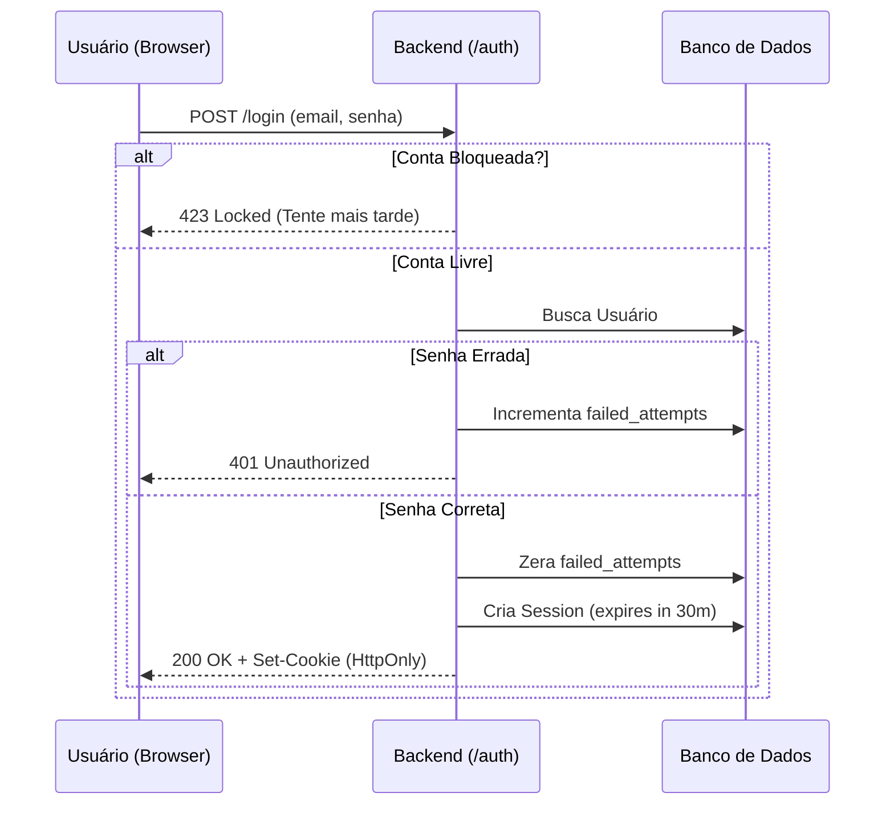

# Arquitetura de Autenticação e Sessão

Este documento detalha o funcionamento, as decisões técnicas e as diretrizes de segurança adotadas para o sistema de autenticação, focado na gestão de sessão e proteção contra força bruta.

## 1. Visão Geral
O sistema utiliza autenticação baseada em tokens de sessão opacos armazenados no servidor (banco de dados), acompanhados de medidas rigorosas contra ataques de força bruta, alinhados com a LGPD e boas práticas de Segurança da Informação.

## 2. Decisões Técnicas e Justificativas (Segurança)

### Por que usar Sessão no Banco de Dados em vez de JWT?
Foi decidido **não utilizar JSON Web Tokens (JWT)** para a gestão da sessão final.
- **Justificativa:** O JWT é *stateless* (sem estado). Se um token JWT for roubado, o servidor não consegue revogá-lo imediatamente, abrindo brecha para sequestro de sessão até que o token expire naturalmente.
- **Nossa solução:** Usamos um token opaco gerado por `secrets.token_urlsafe(32)`. O token fica salvo no banco de dados (`table sessions`). Quando o usuário faz logout, nós preenchemos o campo `revoked_at` no banco, invalidando a sessão **imediatamente**.

### Por que bloquear por tempo (Time-Lock) na Força Bruta?
Se um usuário errar a senha 5 vezes, a conta é bloqueada por 15 minutos.
- **Justificativa:** Evitamos o bloqueio definitivo da conta. Se o bloqueio fosse definitivo, um atacante mal-intencionado poderia travar as contas de usuários legítimos de propósito, gerando um ataque de Negação de Serviço (DoS). O bloqueio temporário atrasa bots sem prejudicar o usuário real de forma permanente.

## 3. Conformidade com a LGPD

O modelo de dados foi estruturado considerando o **Artigo 18 da LGPD** (Direitos do Titular):
- **Direito à eliminação:** A tabela `sessions` foi configurada com restrição de chave estrangeira `ON DELETE CASCADE` vinculada ao `user_id`. Isso garante que, se um usuário solicitar a exclusão de seus dados pessoais do sistema, todas as suas sessões e históricos associados serão automaticamente expurgados do banco de dados, sem deixar rastros órfãos.
- **Minimização de dados:** O cookie salvo na máquina do usuário contém **apenas** o token opaco (sem armazenar e-mail ou nome no navegador) e usa a flag `HttpOnly` para mitigar ataques XSS.

## 4. Diagrama de Fluxo (Login e Força Bruta)

