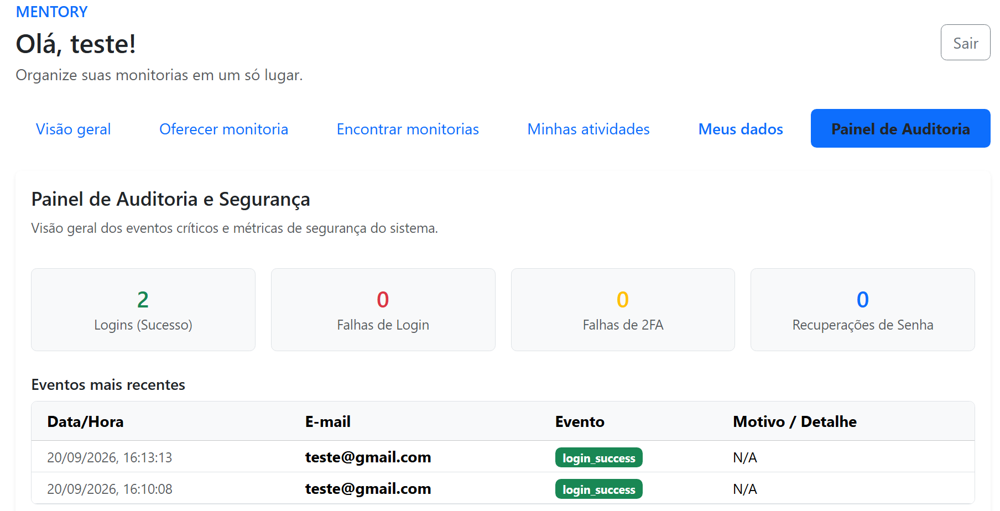
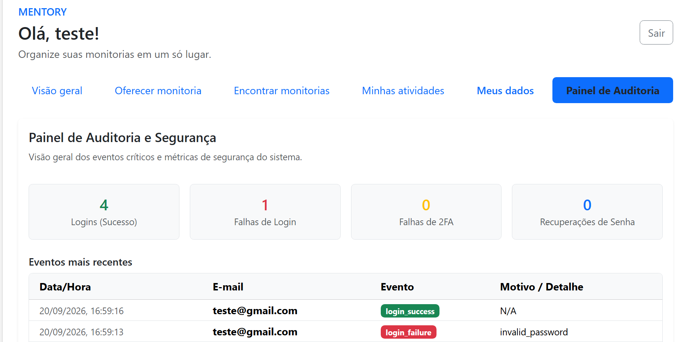
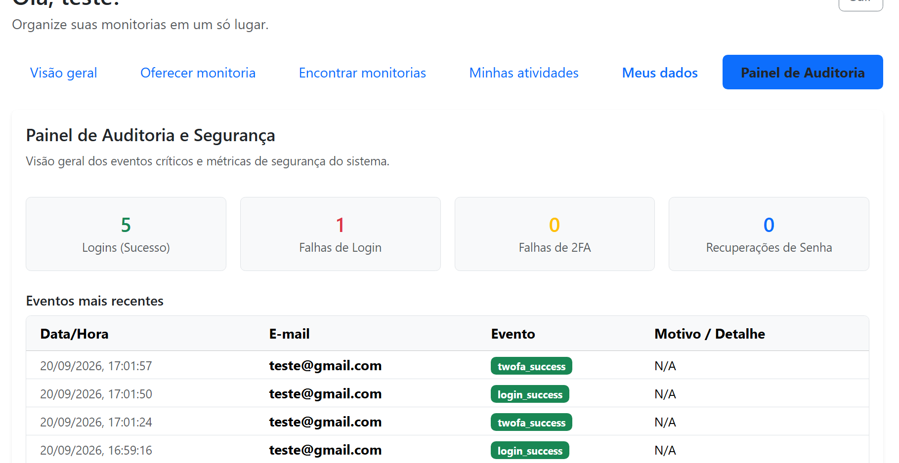
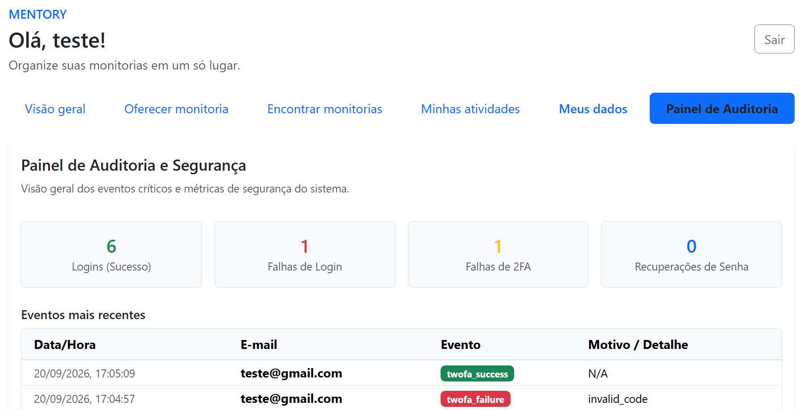
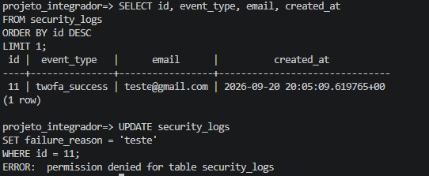
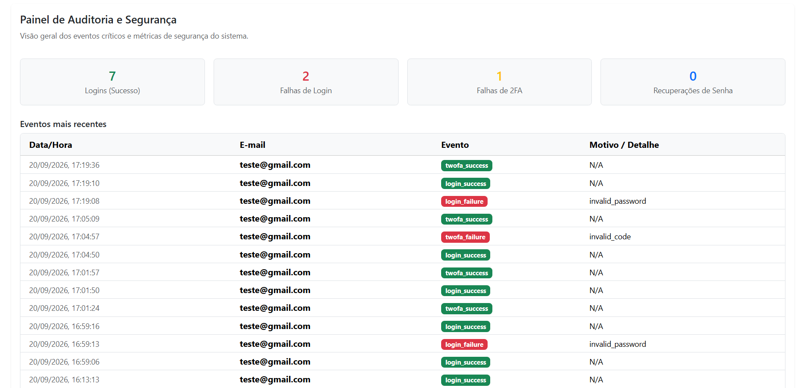

# Evidências — Auditoria e Logs

Este documento apresenta os testes realizados para validar o registro e a
visualização de eventos de segurança da plataforma Mentory.

## 1. Login com sucesso

### Passo a passo

1. Acessar a tela de login pelo frontend.
2. Informar um e-mail cadastrado.
3. Informar a senha correta.
4. Realizar o login.
5. Acessar o Painel de Auditoria.
6. Verificar o registro do evento de login bem-sucedido.

### Evidência

---

## 2. Login com falha

### Passo a passo

1. Sair da conta.
2. Acessar novamente a tela de login.
3. Informar um e-mail cadastrado.
4. Informar uma senha incorreta.
5. Confirmar que o acesso foi recusado.
6. Acessar o Painel de Auditoria após realizar um login válido.
7. Verificar o registro do evento de falha no login.

### Evidência

---

## 3. Validação do 2FA com sucesso

### Passo a passo

1. Configurar o 2FA para a conta utilizada nos testes.
2. Confirmar a configuração utilizando um código válido.
3. Sair da conta.
4. Realizar o login novamente.
5. Informar o código 2FA válido.
6. Confirmar o acesso à plataforma.
7. Verificar o registro do evento de sucesso do 2FA no Painel de Auditoria.

### Evidência

---

## 4. Falha na validação do 2FA

### Passo a passo

1. Sair da conta.
2. Realizar o login novamente.
3. Informar um código 2FA inválido.
4. Confirmar que o acesso não foi concluído.
5. Realizar um novo login com código válido.
6. Acessar o Painel de Auditoria.
7. Verificar o registro da falha na validação do 2FA.

### Evidência

---

## 5. Proteção contra alteração dos logs

### Passo a passo

1. Acessar o banco de dados utilizando o usuário da aplicação.
2. Selecionar um registro existente da tabela de logs.
3. Tentar alterar o registro.
4. Confirmar que a operação é recusada pelo PostgreSQL.
5. Tentar excluir o registro.
6. Confirmar que a operação também é recusada.

### Evidência

---

## 6. Painel de Auditoria

### Passo a passo

1. Acessar o sistema com a conta autorizada para o painel.
2. Abrir o Painel de Auditoria.
3. Verificar as métricas de eventos.
4. Verificar a lista de eventos recentes.
5. Confirmar a presença dos eventos gerados durante os testes.

### Evidência

---

## Validação pelo frontend

Os cenários de login e validação do 2FA foram realizados por meio da
interface do frontend.

A tentativa de alteração dos registros de auditoria é realizada diretamente
no banco de dados, pois tem como objetivo validar a proteção das tabelas
contra alterações pelo usuário da aplicação.