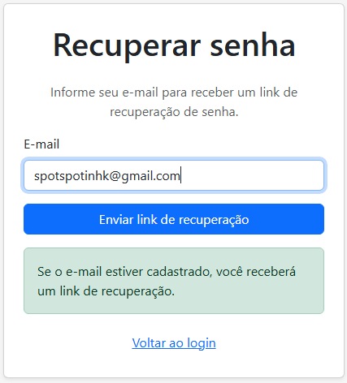
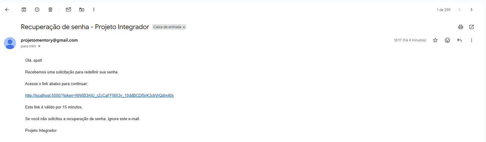
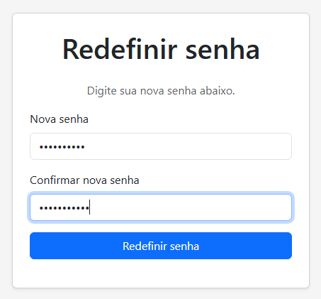
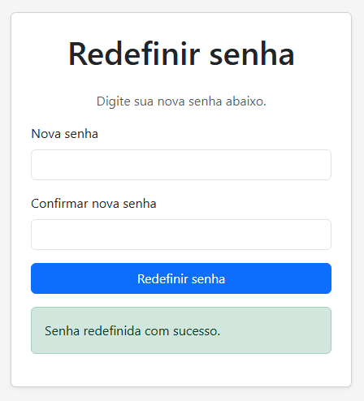
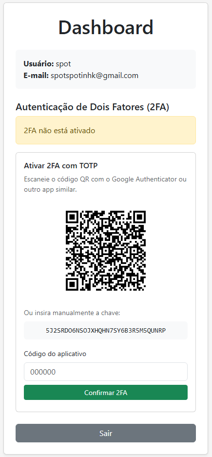
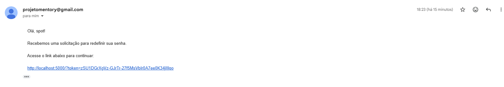
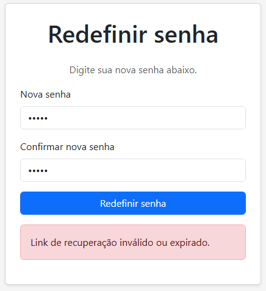
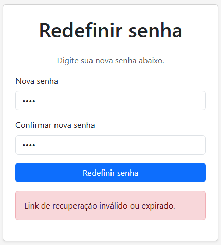

## 1. Solicitação de recuperação de senha

### Passo a passo

1. Acessar a tela de login pelo frontend.
2. Selecionar a opção **"Esqueci minha senha"**.
3. Informar o e-mail cadastrado.
4. Solicitar a recuperação de senha.
5. Verificar a mensagem apresentada pelo sistema.

## 2. Recebimento do link de recuperação

### Passo a passo

1. Acessar a caixa de entrada do e-mail utilizado na solicitação.
2. Localizar o e-mail de recuperação de senha.
3. Verificar o recebimento do link de recuperação.
4. Acessar o link recebido.
5. Verificar o direcionamento para a tela de redefinição de senha.

## 3. Redefinição de senha com token válido

### Passo a passo

1. Acessar a tela de redefinição por meio do link recebido.
2. Informar uma nova senha.
3. Confirmar a nova senha.
4. Confirmar a redefinição.
5. Verificar a mensagem de sucesso apresentada pelo sistema.

## 4. Login com a nova senha

### Passo a passo

1. Retornar à tela de login.
2. Informar o usuário/e-mail cadastrado.
3. Informar a nova senha definida durante a recuperação.
4. Clicar no botão de login.
5. Verificar que as novas credenciais foram aceitas pelo sistema.
6. Confirmar o acesso à conta.

## 5. Token expirado

### Passo a passo

1. Solicitar um novo link de recuperação pelo frontend.
2. Receber o link de recuperação por e-mail.
3. Aguardar o período de validade configurado para o token.
4. Acessar o link após o período de validade.
5. Informar uma nova senha.
6. Tentar confirmar a redefinição.
7. Verificar que a tentativa foi rejeitada pelo sistema.

## 6. Tentativa de reutilização do token

### Passo a passo

1. Solicitar um novo link de recuperação pelo frontend.
2. Acessar o link recebido por e-mail.
3. Redefinir a senha utilizando o token válido.
4. Confirmar que a redefinição foi realizada com sucesso.
5. Acessar novamente o mesmo link utilizado anteriormente.
6. Tentar redefinir a senha novamente.
7. Verificar que a tentativa de reutilização foi rejeitada pelo sistema.

## Validação pelo frontend

Todos os passos deste roteiro são executados exclusivamente pela interface
do frontend, incluindo a solicitação de recuperação, acesso ao link,
redefinição da senha, login com a nova senha e as tentativas com tokens
expirados ou já utilizados.