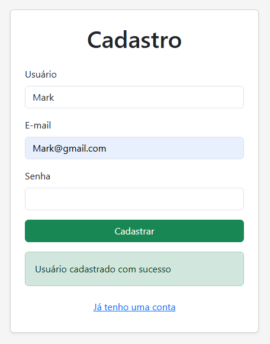
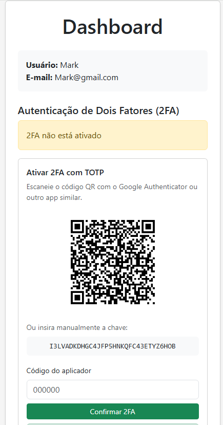
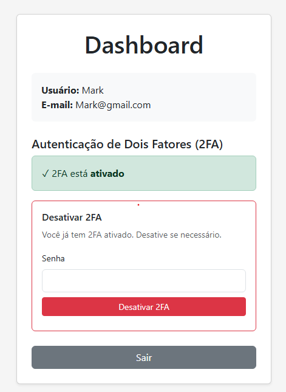
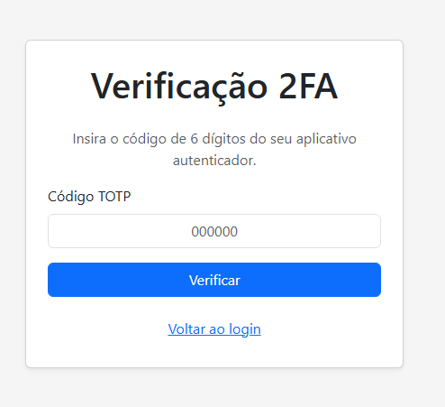
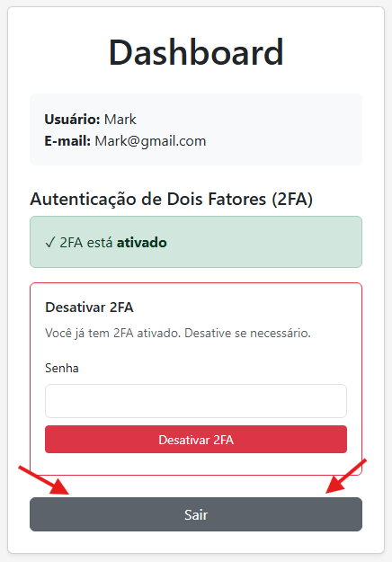
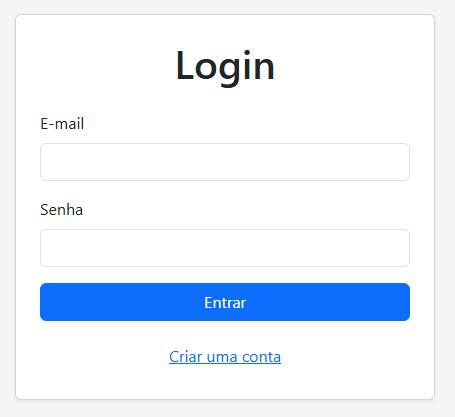
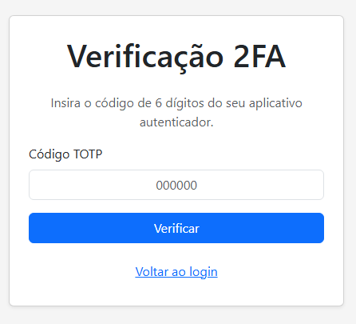
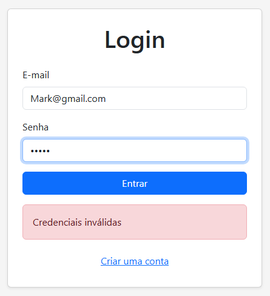
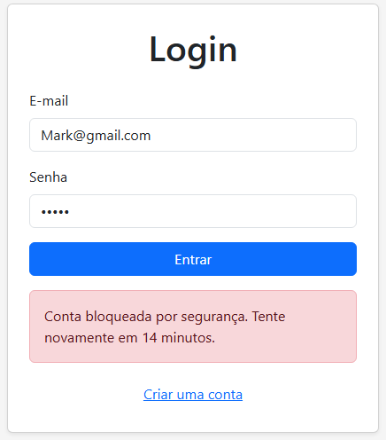
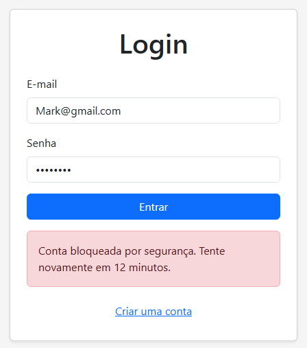

## 1. Cadastro

### Passo a passo

1. Acessar a tela de cadastro.
2. Preencher os dados solicitados.
3. Confirmar o cadastro.
4. Verificar a mensagem de sucesso.

## 2. Login com senha correta

### Passo a passo

1. Acessar a tela de login pelo frontend.
2. Informar o usuário/e-mail cadastrado.
3. Informar a senha correta.
4. Clicar no botão de login.
5. Verificar que as credenciais foram aceitas pelo sistema.
6. Verificar o direcionamento para a etapa de autenticação em dois fatores (2FA).

## 3. Validação do 2FA

### Passo a passo

1. Informar o código de autenticação.
2. Confirmar o código.
3. Verificar a autenticação.

## 4. Acesso autenticado

### Passo a passo

1. Após a validação do 2FA, acessar a conta.
2. Confirmar que o conteúdo está disponível somente para usuário autenticado.

## 5. Logout / sessão

### Passo a passo

1. Realizar logout.
2. Tentar acessar novamente a área protegida.
3. Confirmar que o acesso autenticado foi encerrado.

## 6. Tentativas de login incorretas

### Passo a passo

1. Informar uma senha incorreta.
2. Repetir a tentativa até atingir o limite configurado.
3. Registrar as mensagens apresentadas pelo sistema.

## 7. Bloqueio

### Passo a passo

1. Após atingir o limite de tentativas incorretas, tentar realizar o login novamente.
2. Confirmar que o acesso foi bloqueado.
3. Registrar a mensagem apresentada pelo sistema.

## Validação pelo frontend

Todos os passos deste roteiro são executados exclusivamente pela interface
do frontend, sem necessidade de acesso direto ao banco de dados.