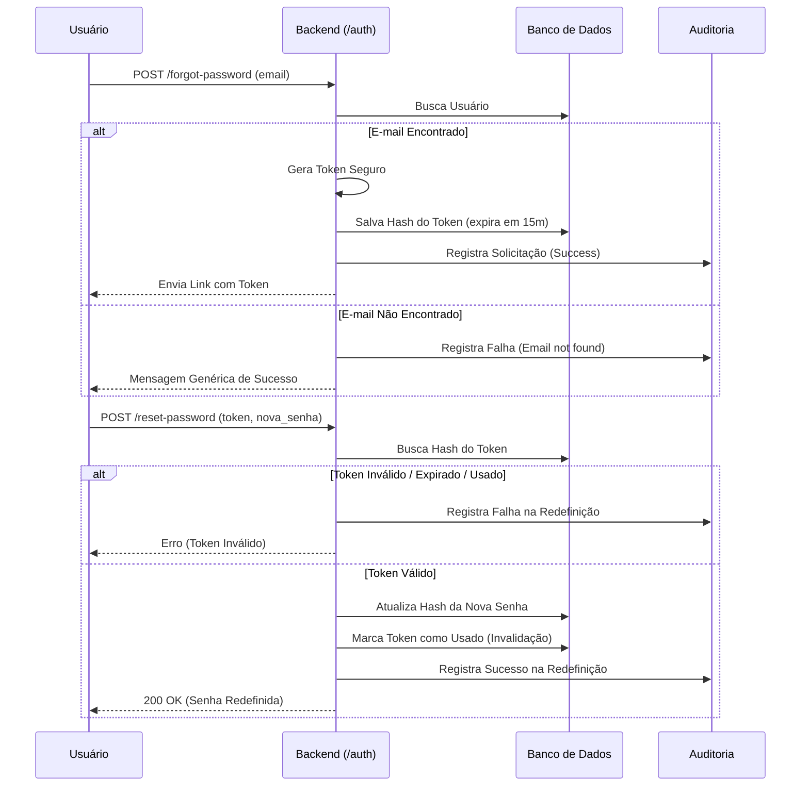

# Arquitetura de Recuperação de Senha

Este documento detalha o fluxo técnico, as decisões de segurança e a estratégia de auditoria adotadas para o processo de recuperação de senha, garantindo alinhamento com as diretrizes da disciplina e com a LGPD.

## 1. Visão Geral do Fluxo

O processo de redefinição de senha foi projetado para ser seguro, rastreável e resistente a ataques. O fluxo completo segue as seguintes etapas:

1. **Solicitação:** O usuário insere seu e-mail. Se o e-mail existir, o sistema gera um token seguro, salva o hash desse token no banco com um prazo de expiração e simula o envio do link de recuperação para o usuário.
2. **Exibição/Envio:** O link (contendo o token em texto puro) é exibido/enviado para o usuário.
3. **Redefinição:** O usuário acessa o link e insere uma nova senha. O sistema verifica a validade, expiração e status de uso do token.
4. **Invalidação:** Se o token for validado, a nova senha é encriptada e salva. O token é imediatamente invalidado.
5. **Registro de Log:** Todas as etapas críticas (solicitação, sucesso e falhas) geram eventos de auditoria sem expor dados sensíveis.

## 2. Diagrama do Fluxo

## 3. Justificativas Técnicas de Segurança

### 3.1. Geração do Token
- **Decisão:** Utilizamos `secrets.token_urlsafe()` nativo do Python.
- **Justificativa:** Esta biblioteca utiliza a fonte de aleatoriedade do sistema operacional (CSPRNG), sendo criptograficamente segura. O token gerado não é previsível, mitigando ataques de adivinhação (brute-force).

### 3.2. Tempo de Expiração
- **Decisão:** O token expira estritamente em **15 minutos**.
- **Justificativa:** Janelas de tempo curtas reduzem drasticamente a superfície de ataque caso o link seja interceptado ou vazado de alguma forma. Após esse período, o banco rejeita qualquer tentativa.

### 3.3. Estratégia de Invalidação
- **Decisão:** Invalidação lógica no banco (preenchimento da coluna `used_at`).
- **Justificativa:** Um token de recuperação deve ter uso único (One-Time Use). Assim que a senha é alterada com sucesso, a coluna `used_at` recebe o timestamp atual. Qualquer tentativa subsequente de uso do mesmo token será barrada, prevenindo Replay Attacks.

### 3.4. Estrutura do Log de Auditoria
- **Decisão:** O sistema de auditoria não guarda senhas e salva apenas os 16 últimos caracteres do hash do token.
- **Justificativa:** Seguindo o princípio do privilégio mínimo e adequação à LGPD, o log serve exclusivamente para rastreabilidade (saber quem, quando e o motivo de uma falha). Não registrar o token usável impede que um atacante que ganhe acesso aos logs (ou até mesmo administradores do sistema) consiga sequestrar contas em processo de recuperação. 
