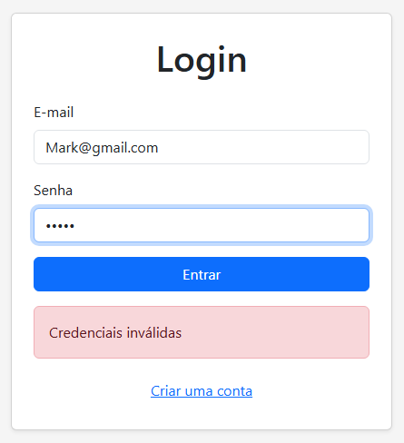
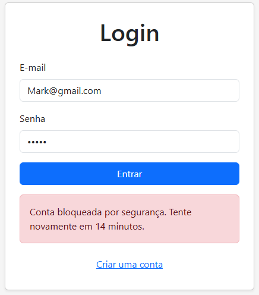
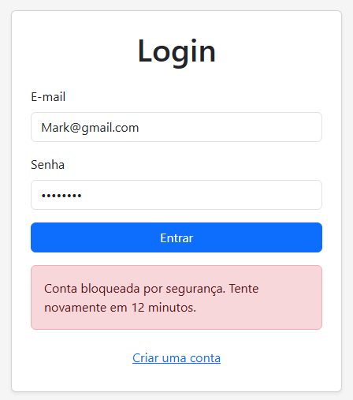
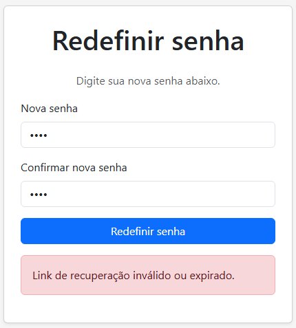
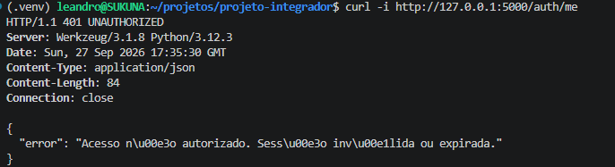
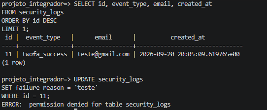
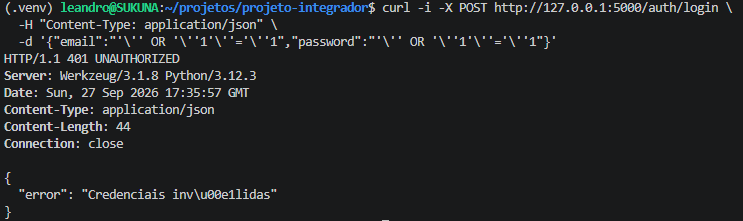
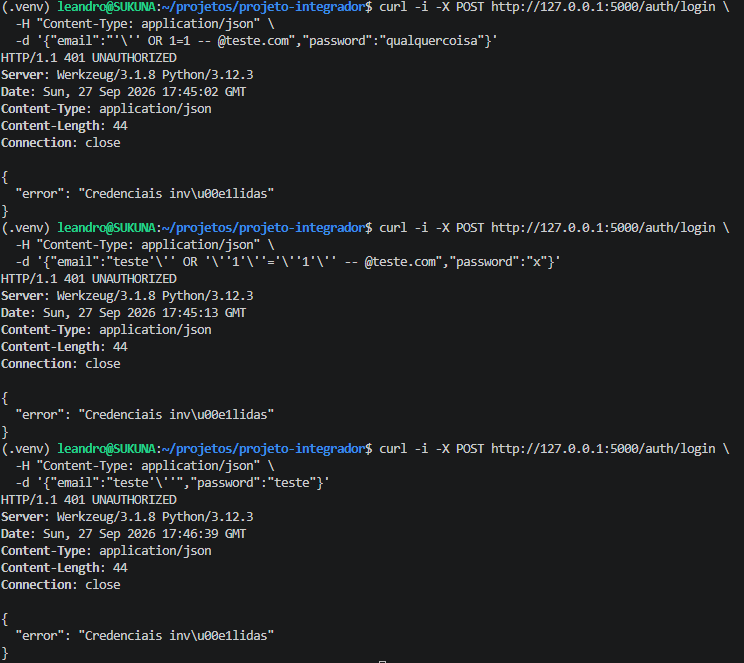
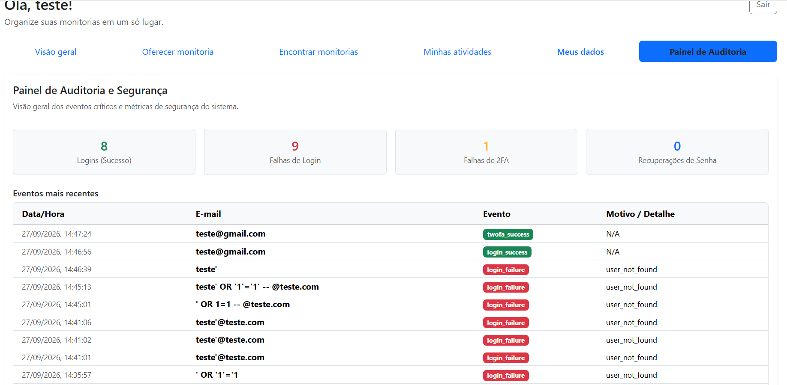

# Testes de Segurança

Este documento registra os testes de segurança realizados no sistema Mentory, com o objetivo de verificar se as principais proteções conseguem impedir tentativas diretas de burlar o sistema.

## 1. Tentativa de login por força bruta

### Objetivo

Verificar se o sistema bloqueia novas tentativas de login após várias tentativas consecutivas com senha incorreta.

### Execução

Foram realizadas tentativas consecutivas de login utilizando uma senha incorreta até atingir o limite configurado pela aplicação. Após atingir o limite, foi realizada uma nova tentativa de login.

### Resultado

**Passou.**

O sistema bloqueou novas tentativas após atingir o limite configurado, impedindo a continuidade das tentativas de autenticação durante o período de bloqueio.

### Evidências







> **Observação:** Este teste também está registrado na documentação de evidências da autenticação, nas seções **6. Tentativas de login incorretas** e **7. Bloqueio**. Consulte [docs/evidencias.md](evidencias.md) para mais detalhes.

---

## 2. Reutilização de token de recuperação de senha

### Objetivo

Verificar se um token de recuperação de senha utilizado anteriormente pode ser reutilizado para realizar uma nova alteração de senha.

### Execução

Foi realizada uma recuperação de senha utilizando um token válido. Após a redefinição da senha, o mesmo link de recuperação foi acessado novamente.

### Resultado

**Passou.**

O sistema rejeitou a tentativa de reutilização do token que já havia sido utilizado.

### Evidência


> **Observação:** Este teste também está registrado na documentação de evidências da recuperação de senha, na seção **6. Tentativa de reutilização**. Consulte [docs/evidencias-recuperacao-senha.md](evidencias-recuperacao-senha.md) para mais detalhes.

---

## 3. Acesso a rota autenticada sem sessão válida

### Objetivo

Verificar se uma rota protegida pode ser acessada diretamente sem possuir uma sessão válida.

### Execução

Foi realizada uma requisição diretamente para a rota protegida `/auth/me`, sem o envio de um cookie de sessão válido.

Comando utilizado:

```bash
curl -i http://127.0.0.1:5000/auth/me
```

### Resultado

**Passou.**

A aplicação rejeitou a requisição e retornou:

```text
HTTP/1.1 401 UNAUTHORIZED
```

com a mensagem:

```json
{
  "error": "Acesso não autorizado. Sessão inválida ou expirada."
}
```

Isso confirma que a rota exige uma sessão válida para permitir o acesso.

### Evidência



---

## 4. Tentativa de alteração e exclusão dos logs de auditoria

### Objetivo

Verificar se o usuário utilizado pela aplicação consegue alterar ou excluir registros das tabelas de auditoria.

### Execução

Foi realizado acesso ao banco utilizando o usuário da aplicação. Em seguida, foram realizadas tentativas de alteração (`UPDATE`) e exclusão (`DELETE`) de registros das tabelas de logs.

### Resultado

**Passou.**

O banco de dados rejeitou as operações de `UPDATE` e `DELETE`, mantendo os registros de auditoria protegidos contra alterações pelo usuário da aplicação.

### Evidência


> **Observação:** Este teste também está registrado na documentação de evidências da auditoria de logs, na seção **5. Proteção contra alteração dos logs**. Consulte [docs/evidencias-auditoria-logs.md](evidencias-auditoria-logs.md) para mais detalhes.

---

## 5. Teste de SQL Injection no login

### Objetivo

Verificar se entradas maliciosas nos campos de login poderiam alterar a consulta ao banco de dados ou permitir autenticação sem credenciais válidas.

### Execução

Foram realizadas tentativas de SQL Injection diretamente no endpoint de autenticação utilizando diferentes variações de entrada, incluindo:

- condição sempre verdadeira com `OR '1'='1'`;
- tentativa de bypass utilizando `OR 1=1` e comentário SQL;
- tentativa de provocar erro de consulta utilizando uma aspa simples.

### Resultado

**Passou.**

Em todas as tentativas, a aplicação retornou:

```text
HTTP/1.1 401 UNAUTHORIZED
```

com a mensagem:

```json
{
  "error": "Credenciais inválidas"
}
```

Não houve autenticação indevida, erro de SQL exposto ou informação interna do banco de dados na resposta.

### Evidências





---

## Resumo dos resultados

| Teste | Resultado |
| --- | --- |
| Login por força bruta | Passou |
| Reutilização de token de recuperação | Passou |
| Acesso sem sessão válida | Passou |
| Alteração/exclusão dos logs | Passou |
| SQL Injection no login | Passou |

Todos os testes de segurança previstos foram executados e documentados, com evidências correspondentes aos resultados obtidos.