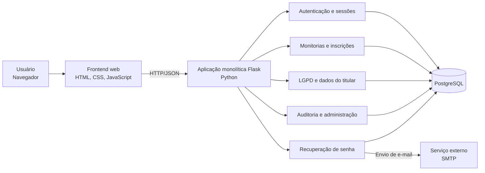

# Visão geral do Mentory

O **Mentory** é uma plataforma de monitoria acadêmica que conecta alunos
dispostos a oferecer ajuda em uma disciplina com alunos que procuram apoio.
O sistema foi desenvolvido como parte do Projeto Integrador da UMC e tem
como foco a autenticação segura, a proteção de dados pessoais e o registro
das operações relevantes.

## Arquitetura do sistema

O Mentory utiliza uma **arquitetura monolítica em camadas**, no modelo
cliente-servidor e com três camadas principais:

1. **Apresentação:** aplicação web em HTML, CSS e JavaScript, servida pelo
   próprio Flask e executada no navegador do usuário.
2. **Aplicação:** backend Python com Flask, organizado em rotas (Blueprints),
   modelos SQLAlchemy e utilitários de autenticação, sessão, recuperação de
   senha e e-mail.
3. **Dados e integrações:** banco de dados PostgreSQL para persistência e
   serviço externo SMTP para envio de mensagens de recuperação de senha.

É uma arquitetura monolítica porque a apresentação, a API e as regras de
negócio são entregues pela mesma aplicação Flask e implantadas como uma
unidade. O PostgreSQL e o SMTP são dependências externas acessadas pelo
backend; eles não constituem serviços internos separados do Mentory.

### Motivo da escolha

Essa arquitetura foi escolhida porque atende de forma proporcional ao
problema que o Mentory precisa resolver nesta etapa: conectar alunos,
gerenciar ofertas de monitoria e controlar inscrições em uma única
plataforma web. O projeto possui uma equipe e um domínio ainda reduzidos,
portanto manter os módulos em uma aplicação facilita o desenvolvimento, os
testes, a implantação local e a apresentação do Projeto Integrador, sem o
custo operacional de distribuir a solução em vários serviços.

A separação em camadas evita que essa simplicidade resulte em código
desorganizado. As rotas recebem as requisições, os módulos de aplicação
concentram os fluxos de negócio e o PostgreSQL mantém os dados relacionais.
Assim, autenticação, LGPD e auditoria podem evoluir sem misturar a interface
com o acesso ao banco, além de permitir a aplicação consistente das regras de
segurança e das permissões.

O modelo também é adequado ao tipo de dado tratado pelo Mentory. Como
sessões, consentimentos, ofertas, inscrições e registros de auditoria
possuem relacionamentos, o PostgreSQL oferece integridade referencial e
transações em um ponto central. O backend Flask, por sua vez, centraliza a
validação, o controle de acesso e as integrações com o SMTP, reduzindo
duplicação e facilitando o rastreamento das operações.

Por fim, a escolha não impede o crescimento do sistema. Se o volume de
usuários ou a complexidade aumentarem, os módulos que possuem maior demanda
podem ser separados gradualmente, preservando inicialmente uma solução
simples e de baixo custo e evitando a complexidade prematura de uma
arquitetura distribuída.

## Visão dos componentes

## Módulos principais

### Autenticação e gestão de sessão

O módulo de autenticação trata cadastro, login, logout, sessão persistida no
banco, bloqueio temporário após tentativas malsucedidas e autenticação de
dois fatores (2FA) baseada em TOTP. As senhas são armazenadas como hash
adaptativo, e os tokens de sessão são opacos e revogáveis no servidor.

Documentação: [Autenticação e sessão](autenticacao.md).

### Recuperação de senha

O módulo permite solicitar a redefinição de senha por e-mail. O token é
gerado de forma segura, armazenado no banco apenas em formato protegido,
possui prazo de expiração e é invalidado após o uso. O envio é realizado
pelo backend por SMTP, utilizando as configurações fornecidas no ambiente.

Documentação: [Recuperação de senha](recuperacao-senha.md).

### Monitorias e inscrições

Este é o núcleo funcional da plataforma. Usuários podem criar ofertas de
monitoria associadas a uma disciplina e outros usuários podem se inscrever
nessas ofertas, estabelecendo o relacionamento entre monitor e mentorado.

### LGPD e dados pessoais

O sistema registra o consentimento do titular, permite consultar os dados da
conta, exportá-los e solicitar a exclusão da conta. A modelagem relacional
usa exclusões em cascata para remover os relacionamentos associados quando a
conta é eliminada.

Documentação: [Conformidade com a LGPD](lgpd.md) e
[Mapeamento de dados pessoais](dados-pessoais.md).

### Auditoria e administração

Eventos de autenticação, 2FA e recuperação de senha são registrados para
rastreabilidade. O módulo administrativo consolida esses eventos em um
painel restrito, enquanto as permissões do banco protegem os registros
contra alteração e exclusão pela aplicação.

Documentação: [Painel de auditoria](auditoria-logs.md) e
[Imutabilidade dos logs](logs-imutaveis.md).

## Stack tecnológica

| Camada | Tecnologia | Responsabilidade |
|---|---|---|
| Frontend | HTML, CSS, JavaScript e Bootstrap | Interface e interação com o usuário |
| Backend | Python 3.13 e Flask 3 | Rotas HTTP, regras de negócio e integração |
| Persistência | SQLAlchemy e PostgreSQL 16 | Modelos, relacionamentos e dados da aplicação |
| Autenticação | bcrypt e TOTP | Proteção de senhas e segundo fator |
| E-mail | SMTP com STARTTLS | Envio de links de recuperação |
| Execução local | Docker Compose | Orquestração do PostgreSQL |

## Documentação técnica

Este documento é o ponto de entrada para a documentação do projeto:

- [Autenticação e sessão](autenticacao.md)
- [Recuperação de senha](recuperacao-senha.md)
- [Conformidade com a LGPD](lgpd.md)
- [Mapeamento e minimização de dados pessoais](dados-pessoais.md)
- [Painel de auditoria](auditoria-logs.md)
- [Imutabilidade dos logs de auditoria](logs-imutaveis.md)
- [Evidências de autenticação](evidencias.md)
- [Evidências de recuperação de senha](evidencias-recuperacao-senha.md)
- [Evidências de LGPD](evidencias-lgpd.md)

## Fluxo resumido de uma requisição

1. O usuário interage com a interface web no navegador.
2. O frontend envia uma requisição HTTP para uma rota do backend Flask.
3. A rota valida a entrada e aplica a regra de negócio correspondente.
4. O backend consulta ou altera o PostgreSQL por meio do SQLAlchemy.
5. Quando necessário, o módulo de recuperação de senha aciona o serviço
   SMTP para enviar uma mensagem.
6. O backend devolve a resposta ao frontend, que atualiza a interface.
